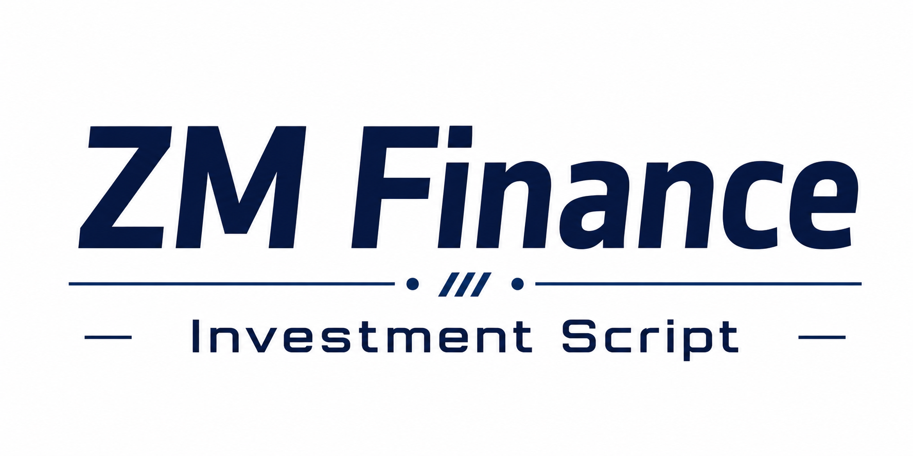

# ZM Finance Investment Script

<p align="center">
  
  </p>

<p align="center">


</p>    

这个项目会从东方财富相关页面的数据接口获取三类日更数据：

- 行情中心：https://quote.eastmoney.com/center/
- 数据中心：https://data.eastmoney.com/center/
- 天天基金：https://fund.eastmoney.com/?spm=100015.lw.4

脚本每次运行会生成：

- `output/latest.xlsx`：最新 Excel 文件，适合手机或电脑打开。
- `output/index.html`：移动端友好的网页预览。
- `output/daily/eastmoney_daily_*.xlsx`：按运行时间保存的历史快照。

> 东方财富网页本身声明相关信息不构成投资建议；本脚本只做个人数据整理和预览，不做交易建议。

## 公网访问

项目已配置 GitHub Pages 自动发布。启用后，任何人都可以打开：

```text
https://hand686.github.io/Finance-Investment-Script/
```

GitHub Actions 会在每天北京时间 `18:30` 自动生成并发布最新网页和 Excel，也可以在 GitHub 的 Actions 页面手动运行 `Daily Eastmoney Pages`。

首次使用时，需要到 GitHub 仓库：

```text
Settings -> Pages -> Build and deployment -> Source -> GitHub Actions
```

确认 Pages 来源为 GitHub Actions。

## 在 PyCharm 里运行

1. 用 PyCharm 打开本文件夹。
2. 创建虚拟环境，或使用系统 Python。
3. 在 PyCharm Terminal 里安装依赖：

```powershell
py -m pip install -r requirements.txt
```

4. 运行采集：

```powershell
py eastmoney_daily.py update
```

如果你在 PyCharm 配置 Run Configuration：

- Script path：`eastmoney_daily.py`
- Parameters：`update`
- Working directory：当前项目目录

## 手机预览

先生成数据：

```powershell
py eastmoney_daily.py update
```

再启动网页服务：

```powershell
py eastmoney_daily.py serve --host 0.0.0.0 --port 8000
```

终端会打印类似：

```text
Preview: http://127.0.0.1:8000/
Preview: http://192.168.x.x:8000/
```

手机和电脑连同一个 Wi-Fi 后，用手机浏览器打开 `http://192.168.x.x:8000/`。如果打不开，通常是 Windows 防火墙没有放行 Python，允许一次即可。

## 双击常驻服务

双击运行：

```text
start_eastmoney_service.bat
```

这个 bat 会自动检查依赖，然后启动一个常驻网页服务：

- 启动时立即更新一次数据。
- 服务保持运行后，可以一直通过 URL 访问 `output/index.html`。
- 默认每天 `18:00` 自动更新网页和 Excel。
- 关闭 bat 窗口或按 `Ctrl+C` 会停止服务。

服务启动后，窗口里会显示类似：

```text
Preview: http://127.0.0.1:8000/
Preview: http://192.168.x.x:8000/
```

电脑本机打开 `http://127.0.0.1:8000/`，手机打开 `http://192.168.x.x:8000/`。

注意：`127.0.0.1` 只能在电脑本机打开。手机上要输入电脑的局域网 IP，例如 `http://192.168.x.x:8000/` 或服务窗口显示的 WLAN 地址。

如果手机和电脑在同一个网络但仍打不开，右键用管理员身份运行：

```text
allow_firewall_8000_admin.bat
```

如果想让它在 Windows 登录后自动启动，可以右键运行：

```text
install_startup_service.bat
```

## 每日自动更新

最简单的方法是用 Windows 任务计划程序：

1. 打开“任务计划程序”。
2. 创建基本任务，触发器选“每天”。
3. 操作选“启动程序”。
4. 程序填写本项目里的 `run_daily_update.bat`。
5. 建议设置在 A 股收盘后，例如 16:30 或 18:00。

## 参数

编辑 `config.json`：

- `page_size`：每类数据抓取多少条，默认 50。
- `output_dir`：输出目录。
- `fund_start_date`：基金排行区间开始日。
- `fund_end_date`：留空表示用当天；如果当天无基金数据，脚本会自动向前回退几天。
- `service_port`：常驻网页服务端口，默认 8000。
- `daily_update_time`：常驻服务每天自动更新的时间，默认 18:00。
- `update_on_service_start`：启动服务时是否立即更新一次。
- `market_fs`：东方财富行情市场过滤参数，默认覆盖沪深京 A 股主要市场。
